# PRAKTIKUM 1

# Langkah 1 - Penjelasan

Output adalah Test2 sesuai dengan print dengan kondisi test = "test2", hal ini terjadi karena string dalam varianel test adalah "test2" yang dimana sesuai dengan pengecekan if else kedua

# Langkah 3 - Penjelasan

Terjadi error, hal ini terjadi karena variable test sudah pernah dibuat sebelumnya, untuk mengatasinya cukup dengan mengganti nama variabel yang baru digunakan
Namun tetap ada error

error tersebut terjadi karena kondisi berssifat tidak statis, cara mengatasinya adalah dengan

# PRAKTIKUM 2

# Langkah 1 - Penjelasan

terjadi error 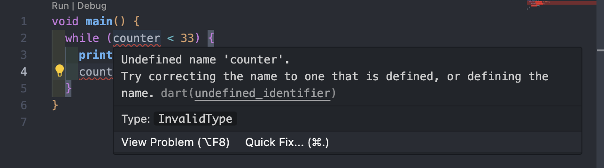 karena variable counter belum dibuat terlebih dahulu, cara mengatasinya 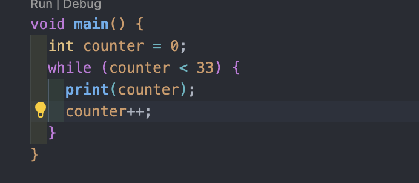
maka output akan menjadi 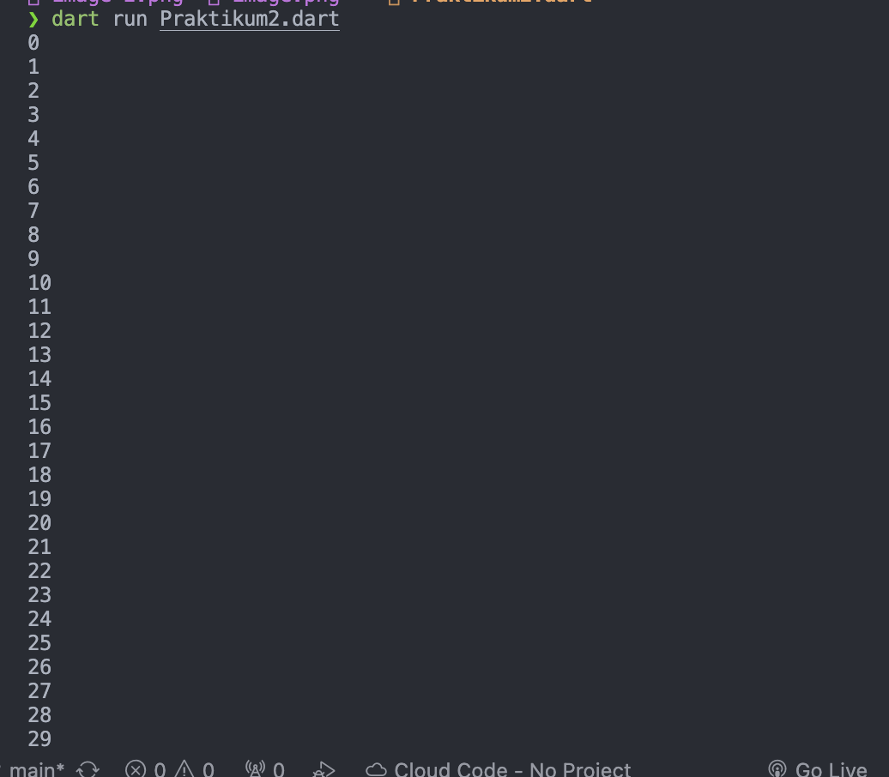
kode tersebut merupakan sebuah perulangan yang akan terus menerus mem-print nilai counter sampai kondisi tidak terpenuhi

# Langkah 3 - Penjelasan

Output:
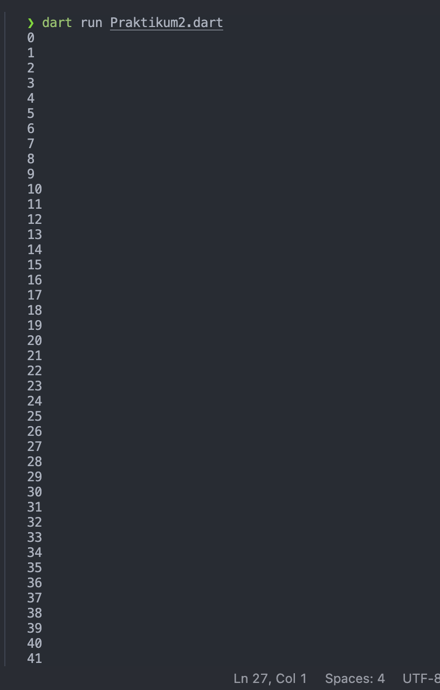
Kode tersebut akan melakukan perulangan, hingga kondisi tidak terpenuhi. bedanya, dalam do while
kode akan di eksekusi terlebih dahulu sebelum melakukan pengecekan kondisi

# PRAKTIKUM 3

# Langkah 1 - Penjelasan

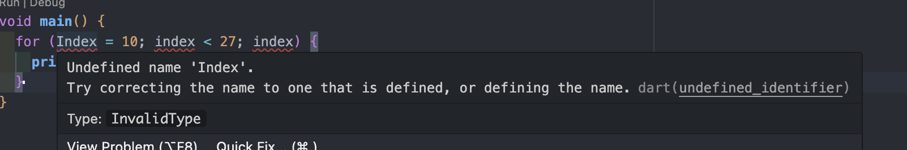 error karena variable index belum di instansiasi dan pemanggilan yang tidak konsisten serta terjadi infinity loop, cara mengatasi 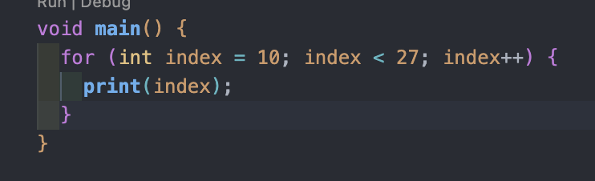

Output:
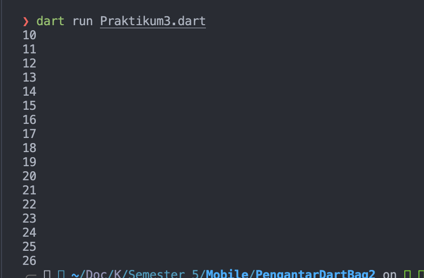

ini akan melakukan perulangan sehingga kondisi index < 27 tidak terpenuhi kemudain setiap perulangan maka index akan di increment

# Langkah 3 - Penjelasan

terjadi error karena penulisan tidak sesuai, cara mengatasinya 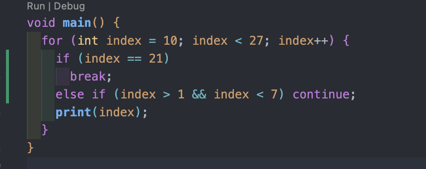,
Output:
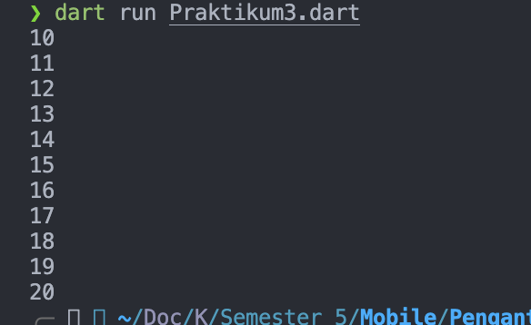
Kode di atas melakukan perulangan mencetak index dari 10 hingga kurang dari 27, kemudian jika index = 21 maka perulangan akan bergenti, kemudian jika index memenuhi syarat >1 atau <7 maka perulangan dilanjutkan tanpa mencetak nilai, sehingga nilai di rentang tersebut tidak tampil di output

# TUGAS

Kode:
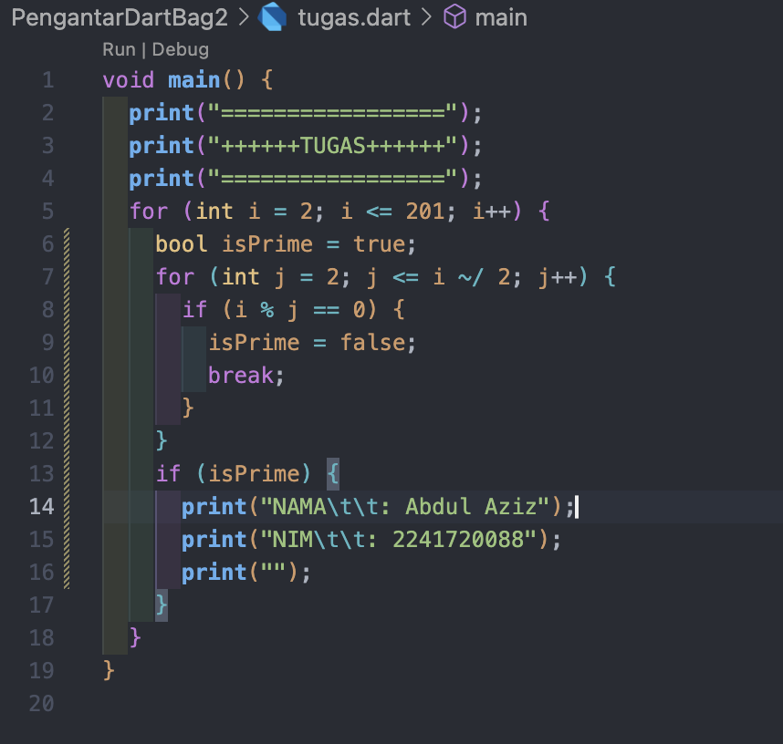

Output:
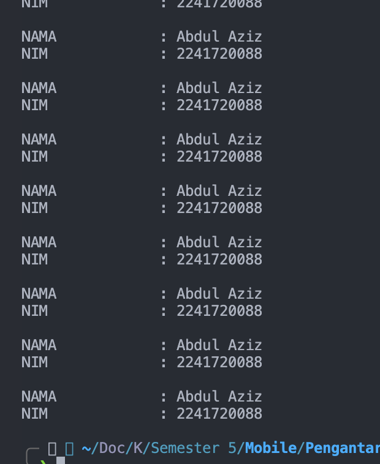
