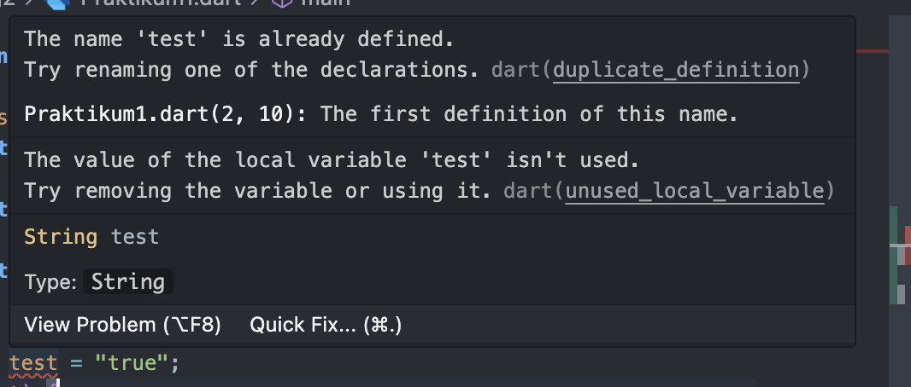
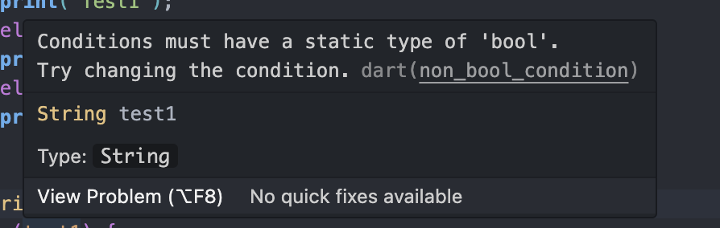
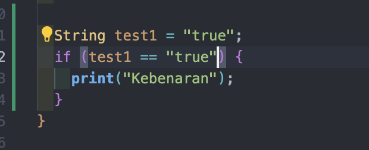

# Langkah 1 - Penjelasan

Output adalah Test2 sesuai dengan print dengan kondisi test = "test2", hal ini terjadi karena string dalam varianel test adalah "test2" yang dimana sesuai dengan pengecekan if else kedua

# Langkah 3 - Penjelasan

Terjadi error, hal ini terjadi karena variable test sudah pernah dibuat sebelumnya, untuk mengatasinya cukup dengan mengganti nama variabel yang baru digunakan
Namun tetap ada error

error tersebut terjadi karena kondisi berssifat tidak statis, cara mengatasinya adalah dengan

