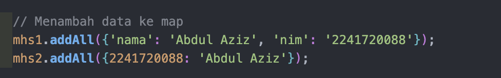
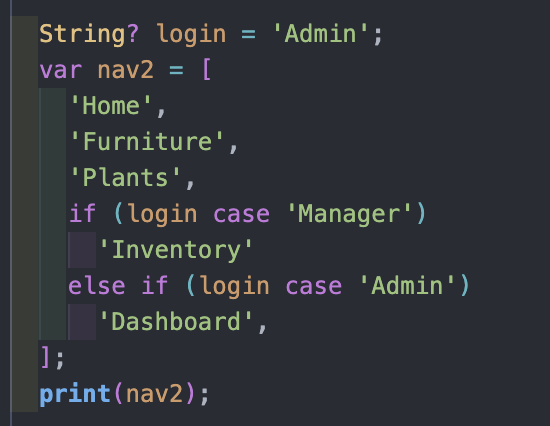
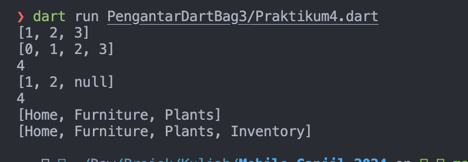
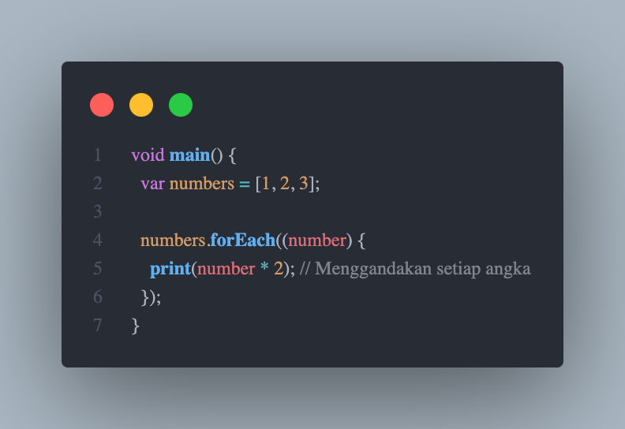
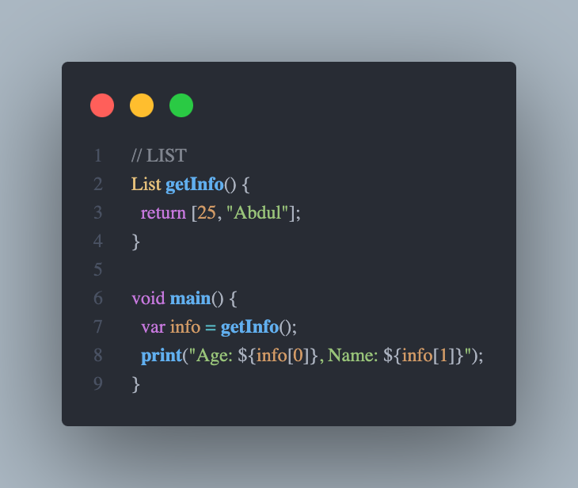

# JAWABAN

# Praktikum 1 - Langkah 1

saat di eksekusi program akan menampilkan output:

fungsi assert berguna untuk mengecek apakah paramter bernilai di dalamnya, untuk kasus tersebut, assert mengecek apakah length (panjang dari list) berjumlah 3 atau tidak, apabila bukan 3 maka akan terjadi error
kemudian ada pengecekan lagi dengan assert yaitu mengcek indeks ke 1 dari list

kemudian digunakan fungsi print untuk menampilkan ke konsol hasil dari pengecek"an tersebut

kemudian di bawahnya ada
list[1] = 1
yang dimana berfungsi untuk mengganti nilai pada indeks ke 1 list menjadi angka 1
setelah itu dilakukan pengecekan lagi kemudian di lakukan print ke konsol

# Praktikum 1 - Langkah 3

apabila langsung mengisikan data null kemudian langsung di ubah maka akan terjadi error karena nilai di list bersifat null dan tidak dapat di ubah 

# Praktikum 2 - Langkah 2

Output , tidak terjadi error
kode tersebut akan membuat sebuah variabel list, kemudian akan di print pada konsol.

# Praktikum 2 - Langkah 3

Output , Tidak ada error namun konsol hanya akan menampilkan 3 buah array kosong
var names1 = <String>{}; dan Set<String> names2 = {};
Berfungsi membuat variable set
yang hanya memperbolehkan tipe data string, set sendiri merupakan variable dalam dart yang tidak akan mengizinkan adanya duplikasi elemen

var names3 = {};
Membuat variable map

Menambah data pada names1 dan names2 dengan menggunakan add(), dan addAll()

fungsi add() akan menambahkan 1 data ke dalam variable yang dituju, sedangkan addAll() akan menambah seluruh list data yang berada di dalam fungsi (bisa menambahkan beberapa data sekaligus)

# Praktikum 3 - Langkah 1

membuat data maps yang memiliki key dan value, kemudian memprintnya pada console

# Praktikum 3 - Langkah 3

Mengubah data dalam maps berdasarkan key

fungsi addAll() pada mhs1 saya buat untuk menambahkan data yang berupa nama dan nim saya dengan key nama dan nim
saya memilih menggunakan cara tersebut karena sebelumnya map mhs1 sudah di inisialisasi dengan key dan value berupa String
kemudian untuk mhs2 saya menggunakan key bernilai integer dan value string menyesuaikan dengan peng-inisialisasi map sebelumnya

# Praktikum 4 - Langkah 2

terjadi error karena nama yang dipanggil pada print tidak sesuai, cara perbaikinya cukup dengan menyesuaikan namanya

output:

menampilkan data yanga ada di list kemudian menampilkan panjang dari list tersebut
fungsi ...list berguna untuk mengambil semua data dari list

# Praktikum 4 - Langkah 3

error karena list harusnya int dan tidak boleh ada null, cara memgatasinya dengan membuat list dapat menampung nilai null

# Praktikum 4 - Langkah 4

karena promoActive belum di definisikan, cara mengatasinya

Output:
apabila promoActive bernilai true

Apabila false

beda karena ada sebuah kondisi yang apabila promoActive bernilai true maka akan ditambahkan nilai 'Outlet' ke dalam list

# Praktikum 4 - Langkah 5

Kode:

Output:

ini dengan nilai login = Manager akan menampilkan inventory

ini menyesuaikan berdasarkan nilai tiap case, karena disini nilai = Admin yang dimana dalam kondisi else if (login case 'Admin')
'Dashboard',
maka akan menambahkan Dashboard ke dalam list

# Praktikum 4 - Langkah 6

Kode:

Output:

Ini akan membuat sebuah list dengan data 1, 2, 3, kemudian list tersebut dibuat kembali menggunakan list comprehension(perulangan), dengan menambahkan #0 berdasarkan elemen elemen di list pertama
kemudian fungsi assert digunakan untuk memeriksa apakah indeks ke 1 benar #1
selanjutnya di print

# Praktikum 5 - Langkah 2

Kode :

Output :

Kode tersebut membuat sebuah record di dart yang dapat menyimpan beberapa kombinasi nilai

# Praktikum 5 - Langkah 3

Kode :

Output :

(int, int) tukar((int, int) record) {
var (a, b) = record;
return (b, a);
}
Membuat fungsi untuk menukar nilai. berisi record yang berisi 2 buah nilai integer dan integer kemudian memisahkan record menjadi 2 variable yang kemudian di return dengan nilai terbalik

var swapped = tukar((2, 1));
Mengimplementasikan fungsi tuka pada variabel swapped

# Praktikum 5 - Langkah 4

Error

Cara mengatasi

Meng-assign nilai ke dalam record terlebuh dahulu sesuai tipe data yang ada pada record

Output :

# Praktikum 5 - Langkah 5

Kode sebelum diganti :

Output sebelum diganti :

Kode sesudah diganti :

Output sesudah diganti :

# TUGAS PRAKTIKUM

2. Fungsi merupakan sekumpulan blok kode yang dapat dijalankan sekaligus saat memanggil fungsi tersebut
3. Jenis jenis parameter di dart
   a. Positional Parameter
   Parameter yang harus diisi berdasarkan urutannya.
   Contoh:
   
   b. Optional Positional Parameters
   Parameter yang bersifat opsional dan ditandai dengan []. Jika tidak diberikan, nilai default-nya adalah null.
   Contoh:
   
   c. Named Parameters
   Parameter yang disebutkan dengan nama saat dipanggil dan bersifat opsional. Bisa juga diberikan nilai default.
   Contoh:
   
   d. Optional Named Parameters
   Parameter yang tidak wajib diisi dan memiliki nilai default.
   Contoh:
   
4. Functions sebagai First-Class Objects
   Dalam Dart, functions adalah objek first-class. Ini berarti fungsi dapat:
   - Disimpan dalam variabel.
   - Diberikan sebagai argumen ke fungsi lain.
   - Dikembalikan sebagai hasil dari fungsi lain.
5. Anonymous Functions
   Anonymous functions (fungsi tanpa nama) adalah fungsi yang dideklarasikan tanpa nama. Biasanya digunakan ketika fungsi hanya dipakai sekali, seperti dalam callback atau fungsi sementara.
   Contoh :
   
   Dalam contoh di atas, (number) { print(number \* 2); } adalah anonymous function yang digunakan dalam forEach.
6. Lexical Scope dan Lexical Closures
   a. Lexical Scope
   Lexical scope mengacu pada cakupan variabel yang didefinisikan di dalam suatu blok kode. Variabel hanya dapat diakses dari dalam cakupan di mana ia didefinisikan.
   Contoh :
   
   b. Lexical Closures
   Lexical closure adalah fungsi yang dapat mengingat dan menggunakan variabel dari lexical scope di mana ia didefinisikan, bahkan setelah cakupan tersebut tidak lagi aktif.
   Contoh :
   
7. Return Multiple Values di Functions
   Dart tidak mendukung pengembalian beberapa nilai secara langsung, tetapi kamu dapat menggunakan records (Dart 3 ke atas) atau menggunakan tuple-like structure dengan cara lain seperti array, map, atau class.
   - Menggunakan Records (Versi dart 3)
     
   - Menggunakan list
     
   - mEnggunakan map
     
